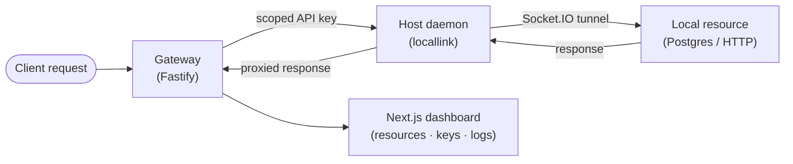

# Local-Link

A self-hosted API gateway that exposes local resources — Postgres databases, HTTP services (ai models yet to be added in support) — through a persistent Socket.IO tunnel, without port forwarding or sharing upstream credentials.

<p align="center">
 
</p>
---

## Problem

Sharing a local database or service with a remote client typically means one of:

- Opening a port and exposing the machine directly.
- Copying credentials into cloud config.
- Running a heavyweight VPN.

Local-Link takes a different approach: the host machine opens an outbound WebSocket tunnel to a central gateway. The gateway validates API keys and proxies requests back through that tunnel. No inbound ports are opened. Credentials never leave the host.

---

## Product flow



1. The **host daemon** (`locallink`) runs on the developer's machine. It opens an outbound tunnel to the gateway and registers local resources (a Postgres port, an HTTP service, etc.).
2. The **gateway** authenticates API key–bearing requests and forwards them through the tunnel.
3. Consumers call the gateway's resource endpoints with a scoped API key — they never see upstream addresses or passwords.
4. The **dashboard** is a Next.js web app for managing resources, issuing API keys, and tailing request logs.

---

## Architecture

```
apps/
  web/          Next.js 15 dashboard (resource management, API key issuance, logs)
  host/         locallink CLI daemon — published as @locallink/cli
services/
  gateway/      Fastify API server (auth, tunnel broker, proxy)
packages/
  shared/       TypeScript types shared across the monorepo
  validators/   Zod validation schemas
  tsconfig/     Shared TypeScript config
examples/
  local-db/     Express API that queries a tunneled Postgres resource via @locallink/client
  http-fe/      Vite React app for end-to-end HTTP proxy testing
  http-node/    Express API for end-to-end HTTP proxy testing
  sdk-examples/ Node scripts that test @locallink/client against a gateway
```

---

## Key features

- **Outbound-only tunnel** — host opens a Socket.IO connection to the gateway; no inbound ports required.
- **Scoped API keys** — keys are bound to a specific resource; revocation propagates to the host agent in milliseconds.
- **Postgres proxy** — the gateway forwards queries over `node-postgres`; the client never sees database credentials.
- **HTTP proxy** — arbitrary HTTP services can be tunnelled; the gateway rewrites asset paths for local web UIs.
- **Better Auth** — OAuth (Google, GitHub) + email/password auth with email verification via Resend.
- **Per-request logs** — every proxied request is recorded: timestamp, method, path, status, latency, API key ID.
- **OpenTelemetry** — optional OTLP trace export from the gateway.

---

## Why this project matters

Local-Link demonstrates backend and platform engineering beyond CRUD:

- Persistent WebSocket tunnel design for outbound-only host connectivity.
- Scoped API-key access to private local resources without exposing upstream credentials.
- Three-tier architecture: CLI daemon + central gateway + web dashboard.
- Postgres and HTTP proxying with credential isolation at the gateway boundary.
- Explicit security tradeoff documentation distinguishing prototype from production requirements.

---

## Tech stack

| Layer      | Tech                                                             |
| ---------- | ---------------------------------------------------------------- |
| Gateway    | Fastify · Prisma · Socket.IO · Better Auth · Zod · OpenTelemetry |
| Dashboard  | Next.js 15 · React 19 · Tailwind CSS                             |
| CLI daemon | TypeScript · Commander · Socket.IO client · node-postgres        |
| Monorepo   | pnpm workspaces · Turborepo · Changesets                         |
| Tooling    | Vitest · ESLint · Prettier · Husky · commitlint                  |

---

## Local setup

**Prerequisites:** Docker, Node.js ≥ 18, pnpm

```bash
corepack enable
pnpm install
```

Copy and fill environment files:

```bash
cp .env.example .env
cp services/gateway/.env.example services/gateway/.env
```

Start Postgres, gateway, and dashboard:

```bash
docker compose up -d
```

Run the host daemon against your local gateway:

```bash
# One-time init — saves gateway URL and host token
pnpm --filter @locallink/host dev init \
  --gateway http://localhost:3003 \
  --token <host-token-from-dashboard>

# Register a local resource
pnpm --filter @locallink/host dev register \
  --id <resource-id> \
  --type http-api \
  --url http://localhost:3000

# Start the tunnel
pnpm --filter @locallink/host dev start
```

CI checks (no Docker required):

```bash
pnpm typecheck
pnpm lint
pnpm test
pnpm build

# or all at once
pnpm ci:local
```

---

## Environment variables

All secrets use placeholder values in `.env.example`. Copy and replace before running.

| Variable                          | Description                                         |
| --------------------------------- | --------------------------------------------------- |
| `DATABASE_URL`                    | Postgres connection string                          |
| `JWT_SECRET`                      | Token signing secret                                |
| `BETTER_AUTH_SECRET`              | Better Auth session secret                          |
| `GOOGLE_CLIENT_ID/SECRET`         | Google OAuth app credentials                        |
| `GITHUB_CLIENT_ID/SECRET`         | GitHub OAuth app credentials                        |
| `RESEND_API_KEY`                  | Transactional email (Resend)                        |
| `GATEWAY_URL`                     | Public URL of the gateway (used by the host daemon) |
| `GATEWAY_BASE_DOMAIN`             | Base domain for subdomain-routed web/API resources  |
| `NEXT_PUBLIC_GATEWAY_BASE_DOMAIN` | Public base domain shown in the dashboard           |
| `FRONTEND_BASE_URL`               | Dashboard origin (used for CORS + OAuth redirects)  |
| `OTEL_*`                          | Optional OpenTelemetry export config                |

---

## API overview

The gateway exposes:

- `GET /health` — liveness check
- `/auth/*` — Better Auth handler (login, OAuth, session)
- `/r/:resourceId/*` — proxied resource endpoint (API-key authenticated)
- Socket.IO namespace for the host daemon tunnel

The dashboard consumes the gateway REST API. The CLI daemon communicates exclusively over the Socket.IO tunnel.

---

## Security notes

This is a prototype. Known gaps before production use:

| Concern          | Current state         | Production need                            |
| ---------------- | --------------------- | ------------------------------------------ |
| SQL parsing      | Raw query forwarding  | Allowlist / prepared-statement enforcement |
| Tenant isolation | Single-user           | Per-user resource scoping                  |
| Audit logging    | In-memory per request | Durable, tamper-evident log store          |
| Rate limiting    | None                  | Per-key rate limits                        |
| Secret rotation  | Manual                | Automated rotation + revocation            |
| Key storage      | DB-stored hashes      | HSM or secret manager                      |
| Monitoring       | OTLP optional         | Alerts, anomaly detection                  |

---

## Prototype vs production

Local-Link demonstrates the architectural pattern cleanly but is **not** production-ready:

- It is intended for a single developer or small team sharing local resources in a controlled environment.
- It has no multi-tenant isolation — all resources are visible to authenticated users of the same instance.
- SQL query forwarding performs no parsing or sanitization.
- There is no rate limiting, no request-size cap enforced at the tunnel layer, and no alerting.

A production version would address all items in the security table above.

---

## Future improvements

- Allowlist-based SQL query validation
- Per-tenant resource isolation
- Durable audit log with export
- Rate limiting per API key
- Key expiry and automatic rotation
- CLI installer script (`curl | sh`)
- Self-hostable Docker Compose bundle with Caddy

---

## Deployment

The gateway is designed to run on a small VPS (tested on DigitalOcean) behind [Caddy](https://caddyserver.com/) for automatic HTTPS. The dashboard deploys to Vercel. See [DEPLOYMENT.md](DEPLOYMENT.md) for setup instructions.

---

## License

MIT
